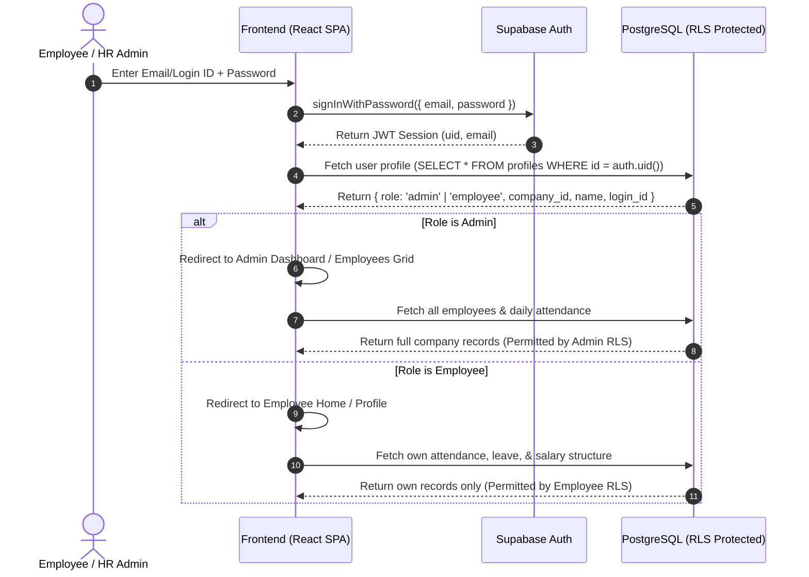

# Dayflow HRMS — System Architecture & Technical Blueprint

> **Status:** Authoritative Technical Architecture  
> **Document Version:** 1.0.0  
> **Target Release:** Hackathon MVP  

---

## 1. System Overview & Technology Stack

Dayflow is built as a cloud-native, high-performance Single Page Application (SPA) backed by a fully relational PostgreSQL database hosted on Supabase. The architecture emphasizes zero-trust security via PostgreSQL Row Level Security (RLS), predictable reactivity, and clear separation of concerns across a 4-engineer development team.

```mermaid
graph TD
    Client["Frontend SPA (React + TypeScript + Vite + Tailwind)"]
    
    subgraph Supabase BaaS
        Auth["Supabase Auth (GoTrue JWT)"]
        Postgres["PostgreSQL DB (Tables, Triggers, Views, RPC)"]
        RLS["Row Level Security Policies (Per-table isolation)"]
        Storage["Supabase Storage (Profile photos, logos)"]
        Edge["Edge Functions (Admin user creation / batch payroll)"]
    end
    
    Client -->|JWT Session| Auth
    Client -->|Direct PostgREST with Anon Key| RLS
    RLS --> Postgres
    Client -->|Avatar / Logo uploads| Storage
    Client -->|Privileged Ops (Employee Provisioning)| Edge
    Edge -->|Service Role Key| Postgres
```

### 1.1 Technology Choices & Rationale
* **Frontend Framework:** React 19 + TypeScript + Vite.
  * *Rationale:* Lightning-fast HMR, lightweight bundle size, strict type safety across shared data contracts, and rich component ecosystem.
* **Styling & Icons:** Tailwind CSS v4 + Lucide React.
  * *Rationale:* High-velocity styling matching the dark modern Excalidraw design specifications without bulky UI framework overhead.
* **Backend & Persistence:** Supabase (PostgreSQL 15+).
  * *Rationale:* Instant PostgREST APIs, native JWT authentication, robust relational integrity, and rock-solid Row Level Security (RLS).
* **State & Data Fetching:** React Hooks + Supabase JS Client (`@supabase/supabase-js`).
  * *Rationale:* Simple, responsive caching and real-time subscription support for attendance systray and live badges.

---

## 2. Repository Structure & Boundary Definitions

```
odoo-hackathon-project/
├── frontend/                     # Person 1 (Lead UI) & Person 3/4 Feature Components
│   ├── public/                   # Static assets (logos, favicon)
│   ├── src/
│   │   ├── assets/               # Local styles and icons
│   │   ├── components/           # Reusable UI library (Navbar, Buttons, Modals, Badges)
│   │   ├── contexts/             # AuthContext, CompanyContext, PresenceContext
│   │   ├── hooks/                # Custom React hooks (useAttendance, useLeave, usePayroll)
│   │   ├── lib/                  # Supabase client singleton, formatting utils, date helpers
│   │   ├── pages/                # Route views (Auth, Dashboard, Employees, Attendance, TimeOff, Payroll)
│   │   ├── services/             # API data access layer wrapping Supabase calls
│   │   ├── types/                # Canonical TypeScript interfaces (mirroring DB contracts)
│   │   ├── App.tsx               # Route declarations & route guards
│   │   ├── main.tsx              # Application entrypoint
│   │   └── index.css             # Tailwind base and custom dark theme tokens
│   ├── index.html
│   ├── package.json
│   ├── tsconfig.json
│   └── vite.config.ts
│
├── supabase/                     # Person 2 (Backend Owner)
│   ├── config.toml               # Supabase CLI configuration
│   ├── migrations/               # Sequential SQL migrations (00001_initial_schema.sql, etc.)
│   ├── seed.sql                  # Deterministic demo data (Demo company, Admin, Employees)
│   └── functions/                # Deno Edge Functions
│       ├── create-employee/      # Service-role admin API to provision employee auth accounts
│       └── generate-payslips/    # Batch monthly payslip calculation engine
│
├── backend/                      # Shared backend scripts, schema tests, seed generators
│   └── README.md                 # Explains backend utility usage (avoiding duplication with supabase/)
│
├── docs/                         # Team documentation & contracts
│   ├── PROJECT_CONTEXT.md        # Authoritative PRD
│   ├── ARCHITECTURE.md           # System Architecture (This file)
│   ├── DATABASE.md               # PostgreSQL Schema, RLS, and Data Contracts
│   ├── OWNERSHIP.md              # 4-Person ownership matrix and branch strategy
│   └── DECISIONS.md              # Architecture Decision Records (ADR)
│
├── .gitignore                    # Root gitignore protecting secrets & build outputs
└── README.md                     # Project overview and quickstart guide
```

### 2.1 Boundary Rule: `backend/` vs `supabase/`
To prevent confusion and duplicated implementations:
* `supabase/` is the **exclusive home** for all database migrations (`supabase/migrations/`), seed files (`supabase/seed.sql`), and Edge Functions (`supabase/functions/`).
* `backend/` is reserved strictly for backend-related test scripts, database seeding utilities, or local verification tooling. Application logic must **never** be duplicated between `backend/` and `supabase/`.

---

## 3. High-Level Application Flow



---

## 4. Layer Responsibilities

### 4.1 Frontend Layer (Person 1 Lead)
* **View & Interaction:** Renders all responsive views matching the dark aesthetic wireframes.
* **Client-Side Routing:** Manages protected routes (`/login`, `/dashboard`, `/employees`, `/profile/:id`, `/attendance`, `/time-off`, `/payroll`).
* **Session Management:** Listens to `onAuthStateChange` to keep session state in `AuthContext`.
* **Optimistic UI & Feedback:** Provides instant visual feedback for check-in/out and leave actions with loading spinners, skeleton screens, and toast notifications.

### 4.2 Database & Security Layer (Person 2 Lead)
* **Relational Integrity:** Enforces foreign keys, unique constraints, and check constraints at the PostgreSQL engine level.
* **Row Level Security (RLS):** Single source of truth for authorization. No client query can read or modify data outside its RLS policy.
* **Triggers & Database Functions:**
  * Auto-generation of sequential Login IDs (`OIJODO20220001`).
  * Auto-calculation of working hours, overtime hours, and attendance statuses on check-out.
  * Audit timestamps (`created_at`, `updated_at`).

### 4.3 Edge Functions Layer (Person 2 Lead)
* **`create-employee`:** Called by HR Officers to provision a new user in Supabase Auth (`supabase.auth.admin.createUser`) and insert the corresponding profile row with an auto-generated temporary password and Login ID.
* **`generate-payslips`:** Performs batch calculations of monthly attendance records and loss-of-pay (LOP) deductions without exposing administrative logic to the client.

### 4.4 Supabase Storage (Person 2 Lead)
* Bucket `avatars`: Public read for authenticated users; write restricted to the owner (`auth.uid()`) or HR Admin.
* Bucket `company-logos`: Public read; write restricted to Admin.

---

## 5. Environment Variables & Security Hygiene

### 5.1 Environment Configuration Files
All environment secrets are strictly excluded via `.gitignore`. The frontend only accesses public environment variables prefixed with `VITE_`.

#### `frontend/.env.example`
```env
VITE_SUPABASE_URL=https://your-project.supabase.co
VITE_SUPABASE_ANON_KEY=your-anon-key-here
```

#### `supabase/.env.example` (Edge Functions only)
```env
SUPABASE_URL=https://your-project.supabase.co
SUPABASE_SERVICE_ROLE_KEY=your-service-role-key-here
```

### 5.2 Cardinal Security Rules
1. **Never expose `SUPABASE_SERVICE_ROLE_KEY` in `frontend/`.**
2. **Never store database credentials in code or Git commits.**
3. **Never disable RLS to solve frontend permission bugs.**

---

## 6. Shared Data Contracts & Type Safety

All frontend models and Supabase queries must strictly import TypeScript types generated directly from the database schema:
* `frontend/src/types/database.types.ts`
* `frontend/src/types/models.ts`

These canonical types define all standard enums:
```typescript
export type UserRole = 'admin' | 'employee';
export type AttendanceStatus = 'present' | 'half_day' | 'absent' | 'on_leave';
export type LeaveType = 'paid' | 'sick' | 'unpaid';
export type LeaveStatus = 'pending' | 'approved' | 'rejected';
```

---

## 7. Development & Integration Workflow

1. **Schema First:** Person 2 establishes and applies migrations in `supabase/migrations/`.
2. **Type Generation:** Export PostgreSQL types to `frontend/src/types/database.types.ts`.
3. **Component & Module Development:** Person 1, 3, and 4 develop their respective modules in feature branches.
4. **Integration Verification:** Test end-to-end flows against local Supabase or staging project.
