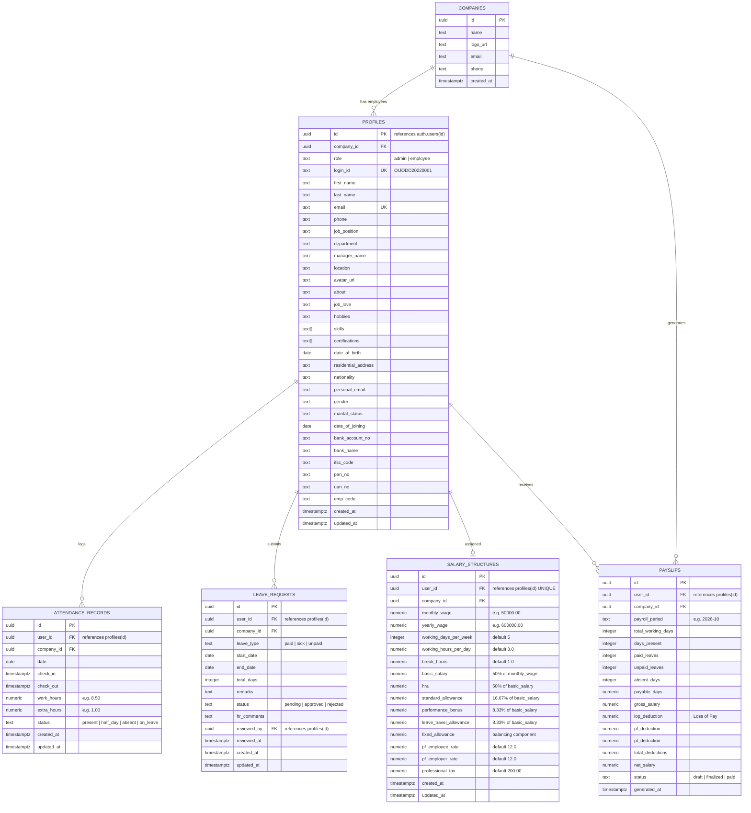

# Dayflow HRMS — Database Schema, Data Contracts & Security Matrix

> **Status:** Authoritative Database Specification  
> **Document Version:** 1.0.0  
> **Primary Engine:** PostgreSQL 15+ (Supabase)  
> **Primary Security Boundary:** Row Level Security (RLS)

---

## 1. Relational Entity-Relationship Diagram (ERD)



---

## 2. Detailed Table Specifications

### 2.1 Table: `companies`
* **Purpose:** Stores registered organization tenant details and branding.
* **Primary Key:** `id` (`UUID`, default `gen_random_uuid()`).
* **Columns:**
  | Column | Type | Nullable | Default | Description |
  | :--- | :--- | :--- | :--- | :--- |
  | `id` | `UUID` | No | `gen_random_uuid()` | Primary Key |
  | `name` | `TEXT` | No | — | Legal company name |
  | `logo_url` | `TEXT` | Yes | `NULL` | Public CDN URL for company logo |
  | `email` | `TEXT` | No | — | Primary contact email |
  | `phone` | `TEXT` | Yes | `NULL` | Primary phone |
  | `created_at` | `TIMESTAMPTZ` | No | `NOW()` | Audit timestamp |
* **CRUD Permissions:**
  - *Read:* All authenticated members belonging to the company.
  - *Create:* Company Admin during sign-up.
  - *Update:* Company Admin only.
  - *Delete:* Restricted (super-admin / not permitted).

---

### 2.2 Table: `profiles`
* **Purpose:** Master employee profile record. Linked 1:1 with `auth.users`.
* **Primary Key:** `id` (`UUID`, references `auth.users(id)` ON DELETE CASCADE).
* **Columns:**
  | Column | Type | Nullable | Default | Description |
  | :--- | :--- | :--- | :--- | :--- |
  | `id` | `UUID` | No | — | Foreign Key referencing `auth.users(id)` |
  | `company_id` | `UUID` | No | — | FK referencing `companies(id)` |
  | `role` | `TEXT` | No | `'employee'` | Enum: `'admin'`, `'employee'` |
  | `login_id` | `TEXT` | No | — | Unique auto-generated ID (e.g. `OIJODO20220001`) |
  | `first_name` | `TEXT` | No | — | Employee first name |
  | `last_name` | `TEXT` | No | — | Employee last name |
  | `email` | `TEXT` | No | — | Primary login email (unique) |
  | `phone` | `TEXT` | Yes | `NULL` | Work contact phone |
  | `job_position` | `TEXT` | Yes | `NULL` | Job title (e.g. Software Engineer) |
  | `department` | `TEXT` | Yes | `NULL` | Department name (e.g. Engineering) |
  | `manager_name` | `TEXT` | Yes | `NULL` | Assigned reporting manager |
  | `location` | `TEXT` | Yes | `NULL` | Office branch / location |
  | `avatar_url` | `TEXT` | Yes | `NULL` | Profile photo storage URL |
  | `about` | `TEXT` | Yes | `NULL` | Resume bio summary |
  | `job_love` | `TEXT` | Yes | `NULL` | "What I love about my job" |
  | `hobbies` | `TEXT` | Yes | `NULL` | "My interests and hobbies" |
  | `skills` | `TEXT[]` | Yes | `'{}'` | Array of skill tags |
  | `certifications` | `TEXT[]` | Yes | `'{}'` | Array of certifications |
  | `date_of_birth` | `DATE` | Yes | `NULL` | Private DOB |
  | `residential_address` | `TEXT` | Yes | `NULL` | Private residential address |
  | `nationality` | `TEXT` | Yes | `NULL` | Nationality |
  | `personal_email` | `TEXT` | Yes | `NULL` | Personal backup email |
  | `gender` | `TEXT` | Yes | `NULL` | Gender identity |
  | `marital_status` | `TEXT` | Yes | `NULL` | Marital status |
  | `date_of_joining` | `DATE` | No | `CURRENT_DATE` | Date of joining |
  | `bank_account_no` | `TEXT` | Yes | `NULL` | **Sensitive:** Bank account number |
  | `bank_name` | `TEXT` | Yes | `NULL` | **Sensitive:** Bank name |
  | `ifsc_code` | `TEXT` | Yes | `NULL` | **Sensitive:** Bank IFSC code |
  | `pan_no` | `TEXT` | Yes | `NULL` | **Sensitive:** Tax identification (PAN) |
  | `uan_no` | `TEXT` | Yes | `NULL` | **Sensitive:** Provident fund UAN |
  | `emp_code` | `TEXT` | Yes | `NULL` | Badge / internal employee code |
  | `created_at` | `TIMESTAMPTZ` | No | `NOW()` | Audit timestamp |
  | `updated_at` | `TIMESTAMPTZ` | No | `NOW()` | Auto-updated via trigger |
* **Sensitive Fields:** `bank_account_no`, `ifsc_code`, `pan_no`, `uan_no`, `date_of_birth`, `residential_address`.
* **CRUD Permissions:**
  - *Read:* Admin can read all employees in their company. Employees can read general info of peers (name, email, department, avatar), but **private fields** (bank, PAN, DOB) only for `auth.uid() = id`.
  - *Create:* Admin / Edge Function only (or self during initial company onboarding).
  - *Update:* Admin can update all fields. Employee can only update `residential_address`, `phone`, `avatar_url`, `about`, `job_love`, `hobbies`, `skills`.
  - *Delete:* Admin only.

---

### 2.3 Table: `attendance_records`
* **Purpose:** Daily attendance, check-in/out timestamps, hours, and status.
* **Primary Key:** `id` (`UUID`, default `gen_random_uuid()`).
* **Constraints:** `UNIQUE (user_id, date)`.
* **Columns:**
  | Column | Type | Nullable | Default | Description |
  | :--- | :--- | :--- | :--- | :--- |
  | `id` | `UUID` | No | `gen_random_uuid()` | Primary Key |
  | `user_id` | `UUID` | No | — | FK referencing `profiles(id)` |
  | `company_id` | `UUID` | No | — | FK referencing `companies(id)` |
  | `date` | `DATE` | No | `CURRENT_DATE` | Calendar date of attendance |
  | `check_in` | `TIMESTAMPTZ` | Yes | `NULL` | Timestamp of check-in |
  | `check_out` | `TIMESTAMPTZ` | Yes | `NULL` | Timestamp of check-out |
  | `work_hours` | `NUMERIC(4,2)` | No | `0.00` | Total hours worked |
  | `extra_hours` | `NUMERIC(4,2)` | No | `0.00` | Overtime hours beyond standard shift |
  | `status` | `TEXT` | No | `'present'` | Enum: `'present'`, `'half_day'`, `'absent'`, `'on_leave'` |
  | `created_at` | `TIMESTAMPTZ` | No | `NOW()` | Timestamp |
  | `updated_at` | `TIMESTAMPTZ` | No | `NOW()` | Timestamp |
* **CRUD Permissions:**
  - *Read:* Admin reads all in company. Employee reads only `user_id = auth.uid()`.
  - *Create:* Employee creates check-in record for current date (`user_id = auth.uid()`).
  - *Update:* Employee updates check-out record for current date (`user_id = auth.uid()`). Admin can edit/correct attendance records.
  - *Delete:* Admin only.

---

### 2.4 Table: `leave_requests`
* **Purpose:** Time-off requests and HR approval lifecycle.
* **Primary Key:** `id` (`UUID`, default `gen_random_uuid()`).
* **Columns:**
  | Column | Type | Nullable | Default | Description |
  | :--- | :--- | :--- | :--- | :--- |
  | `id` | `UUID` | No | `gen_random_uuid()` | Primary Key |
  | `user_id` | `UUID` | No | — | FK referencing `profiles(id)` |
  | `company_id` | `UUID` | No | — | FK referencing `companies(id)` |
  | `leave_type` | `TEXT` | No | — | Enum: `'paid'`, `'sick'`, `'unpaid'` |
  | `start_date` | `DATE` | No | — | Leave starting date |
  | `end_date` | `DATE` | No | — | Leave ending date |
  | `total_days` | `INTEGER` | No | — | Total calendar/working days requested |
  | `remarks` | `TEXT` | Yes | `NULL` | Employee justification |
  | `status` | `TEXT` | No | `'pending'` | Enum: `'pending'`, `'approved'`, `'rejected'` |
  | `hr_comments` | `TEXT` | Yes | `NULL` | HR review comments / feedback |
  | `reviewed_by` | `UUID` | Yes | `NULL` | FK referencing `profiles(id)` |
  | `reviewed_at` | `TIMESTAMPTZ` | Yes | `NULL` | Review timestamp |
  | `created_at` | `TIMESTAMPTZ` | No | `NOW()` | Timestamp |
  | `updated_at` | `TIMESTAMPTZ` | No | `NOW()` | Timestamp |
* **CRUD Permissions:**
  - *Read:* Admin reads all requests in company. Employee reads only `user_id = auth.uid()`.
  - *Create:* Employee submits request for self (`user_id = auth.uid()`).
  - *Update:* Employee can cancel/edit `pending` request. Admin updates `status` (`approved`/`rejected`) and `hr_comments`.
  - *Delete:* Employee can delete own `pending` request; Admin can manage all.

---

### 2.5 Table: `salary_structures`
* **Purpose:** Configured salary components and statutory settings per employee.
* **Primary Key:** `id` (`UUID`, default `gen_random_uuid()`).
* **Constraints:** `UNIQUE (user_id)`.
* **Columns:**
  | Column | Type | Nullable | Default | Description |
  | :--- | :--- | :--- | :--- | :--- |
  | `id` | `UUID` | No | `gen_random_uuid()` | Primary Key |
  | `user_id` | `UUID` | No | — | FK referencing `profiles(id)` UNIQUE |
  | `company_id` | `UUID` | No | — | FK referencing `companies(id)` |
  | `monthly_wage` | `NUMERIC(12,2)` | No | — | Base Monthly Fixed Wage ($W$) |
  | `yearly_wage` | `NUMERIC(12,2)` | No | — | $W \times 12$ |
  | `working_days_per_week` | `INTEGER` | No | `5` | Working days per week |
  | `working_hours_per_day` | `NUMERIC(4,2)` | No | `8.00` | Working hours per day |
  | `break_hours` | `NUMERIC(4,2)` | No | `1.00` | Break hours per day |
  | `basic_salary` | `NUMERIC(12,2)` | No | — | $50\%$ of $W$ |
  | `hra` | `NUMERIC(12,2)` | No | — | $50\%$ of Basic Salary |
  | `standard_allowance` | `NUMERIC(12,2)` | No | — | $16.67\%$ of Basic (or fixed ₹4,167) |
  | `performance_bonus` | `NUMERIC(12,2)` | No | — | $8.33\%$ of Basic |
  | `leave_travel_allowance` | `NUMERIC(12,2)` | No | — | $8.33\%$ of Basic |
  | `fixed_allowance` | `NUMERIC(12,2)` | No | — | Balancing allowance |
  | `pf_employee_rate` | `NUMERIC(5,2)` | No | `12.00` | Employee PF percentage |
  | `pf_employer_rate` | `NUMERIC(5,2)` | No | `12.00` | Employer PF percentage |
  | `professional_tax` | `NUMERIC(10,2)` | No | `200.00` | Fixed monthly PT |
  | `created_at` | `TIMESTAMPTZ` | No | `NOW()` | Timestamp |
  | `updated_at` | `TIMESTAMPTZ` | No | `NOW()` | Timestamp |
* **CRUD Permissions:**
  - *Read:* Admin reads all in company. Employee reads only own row (`user_id = auth.uid()`).
  - *Create / Update / Delete:* **Admin Only.** Employees have ZERO mutation rights.

---

### 2.6 Table: `payslips`
* **Purpose:** Generated monthly payroll record with attendance deductions.
* **Primary Key:** `id` (`UUID`, default `gen_random_uuid()`).
* **Constraints:** `UNIQUE (user_id, payroll_period)`.
* **Columns:**
  | Column | Type | Nullable | Default | Description |
  | :--- | :--- | :--- | :--- | :--- |
  | `id` | `UUID` | No | `gen_random_uuid()` | Primary Key |
  | `user_id` | `UUID` | No | — | FK referencing `profiles(id)` |
  | `company_id` | `UUID` | No | — | FK referencing `companies(id)` |
  | `payroll_period` | `TEXT` | No | — | Format: `YYYY-MM` (e.g. `2026-10`) |
  | `total_working_days` | `INTEGER` | No | — | Standard scheduled working days |
  | `days_present` | `INTEGER` | No | — | Days marked `present` or `half_day` |
  | `paid_leaves` | `INTEGER` | No | `0` | Approved paid leaves |
  | `unpaid_leaves` | `INTEGER` | No | `0` | Approved unpaid leaves |
  | `absent_days` | `INTEGER` | No | `0` | Unexcused absent days |
  | `payable_days` | `NUMERIC(4,2)` | No | — | $\text{Total Working Days} - (\text{Unpaid Leaves} + \text{Absent Days})$ |
  | `gross_salary` | `NUMERIC(12,2)` | No | — | Scheduled monthly wage |
  | `lop_deduction` | `NUMERIC(12,2)` | No | `0.00` | Loss of pay monetary deduction |
  | `pf_deduction` | `NUMERIC(12,2)` | No | — | Employee PF deduction |
  | `pt_deduction` | `NUMERIC(12,2)` | No | `200.00` | Professional Tax deduction |
  | `total_deductions` | `NUMERIC(12,2)` | No | — | $\text{LOP} + \text{PF} + \text{PT}$ |
  | `net_salary` | `NUMERIC(12,2)` | No | — | $\text{Gross} - \text{Total Deductions}$ |
  | `status` | `TEXT` | No | `'draft'` | Enum: `'draft'`, `'finalized'`, `'paid'` |
  | `generated_at` | `TIMESTAMPTZ` | No | `NOW()` | Generation timestamp |
* **CRUD Permissions:**
  - *Read:* Admin reads all in company. Employee reads only own payslips (`user_id = auth.uid()`).
  - *Create / Update / Delete:* **Admin Only** (via Edge Function / RPC).

---

## 3. Attendance → Payroll Integration Contract

### 3.1 Payable Days Calculation Algorithm
To guarantee mathematical correctness and prevent client tampering, payslip generation is computed strictly on the backend:

1. **Working Days ($D_{total}$):** Number of Monday–Friday days (or company working schedule) in the target month (e.g. 22 days).
2. **Present Days ($D_{present}$):** Count of `attendance_records` for `user_id` in month where `status = 'present'` ($1.0$) or `status = 'half_day'` ($0.5$).
3. **Approved Paid Leaves ($L_{paid}$):** Count of days in `leave_requests` where `leave_type IN ('paid', 'sick')` and `status = 'approved'`.
4. **Approved Unpaid Leaves ($L_{unpaid}$):** Count of days in `leave_requests` where `leave_type = 'unpaid'` and `status = 'approved'`.
5. **Unexcused Absences ($D_{absent}$):** Working days where no check-in exists and no approved leave exists:
   $$D_{absent} = D_{total} - (D_{present} + L_{paid} + L_{unpaid})$$
6. **Payable Days ($D_{payable}$):**
   $$D_{payable} = D_{total} - (L_{unpaid} + D_{absent})$$
7. **Loss of Pay (LOP) Calculation:**
   $$\text{Daily Wage} = \frac{\text{Monthly Wage}}{D_{total}}$$
   $$\text{LOP Deduction} = (L_{unpaid} + D_{absent}) \times \text{Daily Wage}$$

---

## 4. Automatic Login ID Generation Contract

### 4.1 Specification
* **Format:** `[Company Prefix][First 2 letters First Name][First 2 letters Last Name][Year of Joining][4-Digit Serial]`
* **Example:**
  * Employee: *John Doe*
  * Joining Year: *2022*
  * Company Prefix: *OI* (Odoo India)
  * Serial: *0001*
  * **Resulting Login ID:** `OIJODO20220001`

### 4.2 PostgreSQL Implementation Design
* Generation logic is encapsulated in a stored function `generate_login_id(company_prefix, first_name, last_name, joining_year)`.
* Uses a dedicated sequence or `SELECT COUNT(*) + 1 FROM profiles WHERE login_id LIKE ... FOR UPDATE` with `LPAD(..., 4, '0')` to ensure atomic, collision-free allocation even during concurrent employee creation.

---

## 5. Row Level Security (RLS) Authorization Matrix

| Resource / Table | Action | Employee (`role = 'employee'`) | Admin / HR (`role = 'admin'`) |
| :--- | :--- | :--- | :--- |
| **`companies`** | SELECT | Own company only | Own company only |
| | INSERT / UPDATE | ❌ Denied | ✅ Permitted for own company |
| **`profiles` (Public fields: name, email, avatar)** | SELECT | ✅ Permitted for colleagues in same company | ✅ Permitted for all in company |
| **`profiles` (Private: bank, PAN, DOB, phone)** | SELECT | ✅ Own record only (`id = auth.uid()`) | ✅ Permitted for all in company |
| | INSERT | ❌ Denied (Admin creates) | ✅ Permitted |
| | UPDATE | ✅ Permitted for self on non-restricted fields | ✅ Permitted on all fields |
| **`attendance_records`** | SELECT | ✅ Own records only (`user_id = auth.uid()`) | ✅ All employees in company |
| | INSERT / UPDATE | ✅ Check-in/out for today (`user_id = auth.uid()`) | ✅ Full edit / manual adjustment |
| **`leave_requests`** | SELECT | ✅ Own requests only | ✅ All requests in company |
| | INSERT | ✅ Submit for self | ✅ Permitted |
| | UPDATE | ✅ Edit own `pending` request | ✅ Approve / Reject & comment |
| **`salary_structures`** | SELECT | ✅ Read-only for self (`user_id = auth.uid()`) | ✅ Full access in company |
| | INSERT / UPDATE / DELETE | ❌ Denied | ✅ Full management |
| **`payslips`** | SELECT | ✅ Read-only for self (`user_id = auth.uid()`) | ✅ Full access in company |
| | INSERT / UPDATE / DELETE | ❌ Denied | ✅ Full management |

---

## 6. Frontend Route Protection vs Backend RLS Boundary

```
[ BROWSER CLIENT ]
  ├── Client Route Guards (React Router)
  │     ├── Redirect unauthenticated users to /login
  │     └── Redirect non-admins from /admin routes to /dashboard
  │     ⚠️ NOTE: Purely for UX navigation. Never trusted for security.
  │
[ NETWORK (HTTPS + JWT Anon Key) ]
  │
[ SUPABASE POSTGREST + POSTGRESQL ENGINE ]
  ├── 🛡️ ROW LEVEL SECURITY (RLS) POLICIES
  │     ├── auth.uid() = user_id
  │     └── EXISTS (SELECT 1 FROM profiles WHERE id = auth.uid() AND role = 'admin')
  └── 🔒 DATA INTEGRITY & AUDITING (Foreign keys, triggers, constraints)
```
