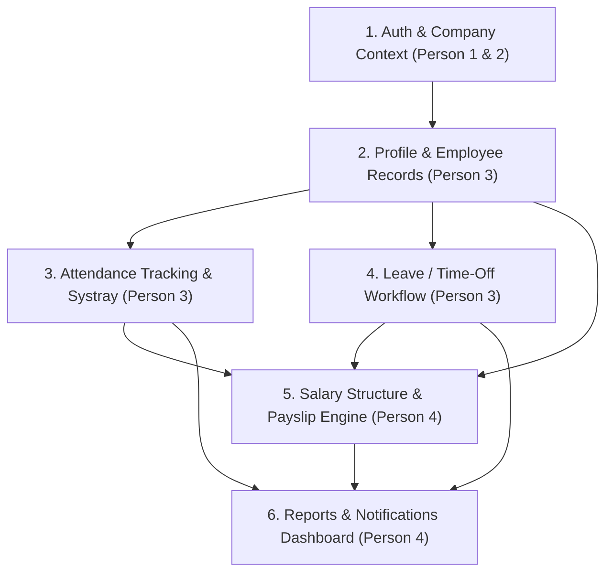

# Dayflow HRMS — Team Ownership, Branching Strategy & Data Contracts

> **Status:** Authoritative Ownership & Collaboration Guide  
> **Document Version:** 1.0.0  
> **Target Release:** Hackathon MVP  

---

## 1. Four-Person Ownership Matrix

| Developer / Persona | Core Responsibilities | Assigned Git Branch | Key Deliverables |
| :--- | :--- | :--- | :--- |
| **Person 1 — Frontend Lead** | Global UI, Design System, Layout, Navigation, Routing, Auth UI, Dashboard foundations, Component library | `feature/frontend` | `App.tsx`, `Navbar`, `Sidebar`, `AuthPages`, `Modal`, `Button`, `Toast`, Layout wrappers |
| **Person 2 — Backend Lead** | Supabase, PostgreSQL, Schema Migrations, Auth Config, RLS Security, Edge Functions, Storage buckets | `feature/backend` | `supabase/migrations/*`, `supabase/seed.sql`, `supabase/functions/*`, DB triggers, RLS policies |
| **Person 3 — Employee Operations** | Employee Directory, Profile Tabs, Check-In/Check-Out Systray, Attendance monthly views, Time-off/Leave workflow | `feature/employee-operations` | `EmployeesGrid`, `ProfileView`, `SystrayWidget`, `AttendanceTable`, `LeaveRequestModal`, `LeaveApprovalTable` |
| **Person 4 — Payroll, Reports & QA** | Salary structure configuration, Automated Payslip generator, Analytics dashboards, System notifications, E2E Testing | `feature/payroll` | `SalaryInfoTab`, `PayslipViewer`, `PayrollRunTable`, `ReportsDashboard`, Automated validation suite |

---

## 2. Git & Branching Strategy

```
main (Production / Stable Demo Branch)
  ↑
  ├── feature/frontend (Person 1)
  ├── feature/backend (Person 2)
  ├── feature/employee-operations (Person 3)
  └── feature/payroll (Person 4)
```

### 2.1 Collaboration Rules
1. **Never commit directly to `main` without review and verification.**
2. **Branch Hygiene:** Rebase or pull `main` before submitting PRs.
3. **No Schema Drift:** Only Person 2 (Backend) creates or modifies database migrations in `supabase/migrations/`.
4. **Zero Duplicate Persistent Stores:** All developers must access data via Supabase and shared TypeScript services.

---

## 3. Shared Data Contracts (Canonical Terms)

To eliminate naming conflicts and runtime errors across the team, all components and queries must strictly adhere to these canonical identifiers:

### 3.1 Identifiers & Foreign Keys
* **`id` (User ID):** `UUID` matching `auth.users(id)` and `profiles.id`.
* **`company_id`:** `UUID` referencing `companies.id`.
* **`login_id`:** `TEXT` auto-generated employee identifier (e.g. `OIJODO20220001`).
* **`emp_code`:** `TEXT` internal employee badge/code (optional).

### 3.2 Canonical Enumerations

#### Role (`UserRole`)
```typescript
export type UserRole = 'admin' | 'employee';
```

#### Attendance Status (`AttendanceStatus`)
```typescript
export type AttendanceStatus = 'present' | 'half_day' | 'absent' | 'on_leave';
```

#### Leave Type (`LeaveType`)
```typescript
export type LeaveType = 'paid' | 'sick' | 'unpaid';
```

#### Leave Status (`LeaveStatus`)
```typescript
export type LeaveStatus = 'pending' | 'approved' | 'rejected';
```

#### Payslip Status (`PayslipStatus`)
```typescript
export type PayslipStatus = 'draft' | 'finalized' | 'paid';
```

#### Payroll Period (`PayrollPeriod`)
* Format: `YYYY-MM` (e.g. `'2026-10'`).

### 3.3 Salary Component Identifiers
* `monthly_wage` — Base gross monthly fixed compensation.
* `yearly_wage` — Calculated as `monthly_wage * 12`.
* `basic_salary` — 50% of `monthly_wage`.
* `hra` — 50% of `basic_salary`.
* `standard_allowance` — 16.67% of `basic_salary` (or ₹4,167 fixed).
* `performance_bonus` — 8.33% of `basic_salary`.
* `leave_travel_allowance` — 8.33% of `basic_salary`.
* `fixed_allowance` — Balancing component to match `monthly_wage`.
* `pf_employee_rate` / `pf_deduction` — 12% of `basic_salary`.
* `pf_employer_rate` — 12% of `basic_salary`.
* `professional_tax` / `pt_deduction` — Fixed ₹200.00 / month.

---

## 4. Cross-Module Dependencies & Data Flow



### Critical Cross-Module Rules:
1. **Attendance Feeds Payroll:** Person 4's payslip engine relies directly on `attendance_records` (present/half-day counts) and `leave_requests` (unpaid leave counts) logged by Person 3.
2. **Leave Feeds Attendance:** When Person 3's leave approval workflow marks a request as `approved`, daily attendance status for those dates must automatically resolve to `on_leave`.
3. **Role Context Feeds Navigation:** Person 1's navigation renders Admin tabs vs Employee tabs based on `profiles.role` emitted by AuthContext.

---

## 5. Phase-by-Phase Implementation Roadmap

* **PHASE 1 — Foundation Documentation & Data Contracts** *(Current)*
  * Establish PRD, Architecture, Database spec, Ownership, and Decision logs.
* **PHASE 2 — Supabase Schema, Auth & RLS** *(Person 2)*
  * Apply sequential migrations, RLS policies, triggers, and deterministic seed data.
* **PHASE 3 — Frontend Foundation & Authentication UI** *(Person 1)*
  * Initialize Vite+React+Tailwind, layout shell, top nav, systray container, Auth/Onboarding pages.
* **PHASE 4 — Employee Profile & Directory** *(Person 3)*
  * Grid cards, search, presence status badges, 4-tab employee profile, HR edit capabilities.
* **PHASE 5 — Attendance Tracking** *(Person 3)*
  * Check-in/out systray widget, live status dot, monthly employee attendance table, admin daily list.
* **PHASE 6 — Leave & Time-Off Management** *(Person 3)*
  * Leave application modal, validation, HR approvals dashboard, comment submission.
* **PHASE 7 — Salary Structure & Payslips** *(Person 4)*
  * Salary structure configurator, automated payslip calculation, employee payslip viewer.
* **PHASE 8 — Reports, Analytics & Notifications** *(Person 4)*
  * Visual analytics, presence statistics, toast notification system.
* **PHASE 9 — End-to-End Integration, Security Verification & QA** *(All / Person 4 Lead)*
  * E2E flow testing, RLS penetration testing, responsive polish, demo rehearsal.
